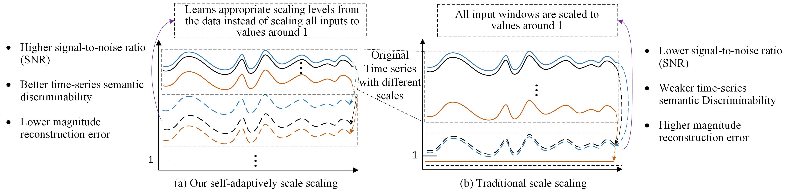
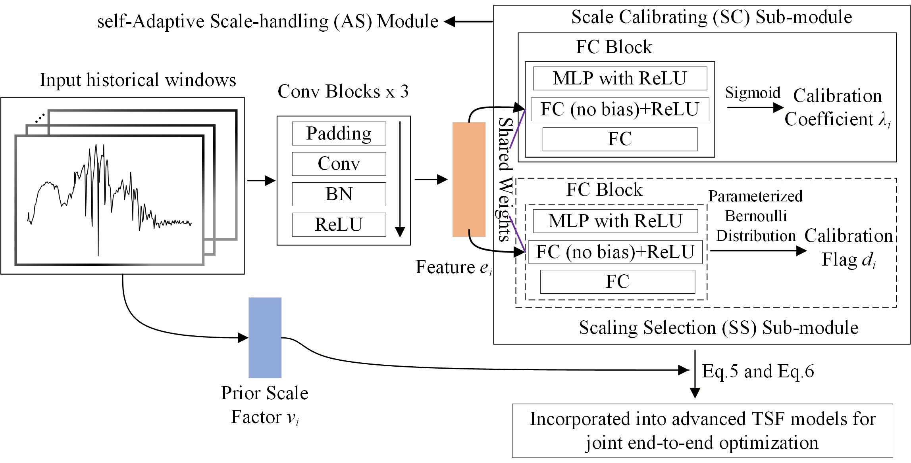

# Self-Adaptive Scale Handling for Forecasting Time Series with Scale Heterogeneity (AS, ICASSP 2024)

## Overview

In real-world industrial scenarios (e.g., fund sales, e-commerce), different time series often differ by orders of magnitude — this is called **scale heterogeneity**. Since these series share similar temporal patterns, joint modeling is desirable. However, existing scaling methods fall short:

- **Global normalization/standardization**: compresses low-scale signals, reducing signal-to-noise ratio.
- **Window-based scaling** : uniformly maps all windows to ~1, destroying semantic discriminability and amplifying inverse-scaling errors for high-scale series.

We propose the **self-Adaptive Scale-handling (AS)** module that learns adaptive scale factors tailored to each input, preserving semantic discriminability while reducing inverse-scaling errors.


**Left:** Our adaptive scaling learns appropriate scaling levels from data. **Right:** Traditional scaling uniformly maps everything to ~1, losing inter-series discriminability and amplifying restoration errors.

## Method

The AS module consists of two sub-modules:

1. **Scale Calibrating (SC)**: Computes a prior mean scaling factor $v_i$ for each window, then learns a calibration coefficient $\hat{\lambda} \in (0,1)$ via a neural network with Sigmoid activation. The calibrated factor $\overline{v}_i = \hat{\lambda} \times v_i$ is smaller than the original, reducing inverse-scaling amplification while retaining scale information.

2. **Scaling Selection (SS)**: A Gumbel-Softmax parameterized Bernoulli decision that determines, for each window, whether to use the calibrated factor $\overline{v}_i$ or retain the original $v_i$. This prevents over-calibration on already well-suited prior mean scaling factors.


<p align="center">

</p>


**AS framework**: (1) extract temporal features from input windows; (2) compute calibration coefficient $\hat{\lambda}$ and binary calibration flag $d_i$; (3) apply scaling — if flag is 1, calibrate the prior mean scaling factor; otherwise, retain original.

The AS module is architecture-agnostic and can be seamlessly integrated into any TSF backbone for end-to-end training.

## Datasets

We collect fund sales datasets from **Ant Fortune** (an online wealth management platform on Alipay). Each dataset contains daily transaction records of multiple fund products spanning up to two years (ending November 2022).

| Dataset | Description |
|---------|-------------|
| Fund_all | Fund sales dataset 1 |
| Fund_all_2 | Fund sales dataset 2 |

**Key features per fund product:**
- `product_pid`: Fund product ID
- `transaction_date`: Transaction date
- `apply_amt`: Purchase (applying) transaction amount
- `redeem_amt`: Redemption transaction amount
- `is_summarydate`: Whether the date is a summary date (non-trading day volumes aggregated to next trading day)
- `during_days`: Holding period (days before tradable)
- `is_trade`: Whether the current day is a trading day
- `is_weekend_delay`: Whether it is a weekend before a trading day
- `holiday_num`: Number of statutory holidays before the trading day

The sales of different fund products exhibit significant scale heterogeneity (ranging from hundreds to decimal places), making these datasets ideal for validating our method.

## Usage

### Download Datasets

Download from: https://drive.google.com/drive/folders/1I819ARskzUCvDS76f8OqLuVaVFqsZ0LK?usp=sharing

Place the downloaded `Fund_all` and `Fund_all_2` folders into the `dataset/` directory.

### Run Experiments

```bash
python run_baselines_fund.py
```

Follow the annotations in `run_baselines_fund.py` to reproduce results. The scale-handling strategies are:

| Abbreviation | Strategy |
|---|---|
| VS | Vanilla window-based scaling (divide by prior mean) |
| SC | Only Scale Calibrating sub-module |
| SS+SC (AS) | Full AS module (Scale Calibrating + Scaling Selection) |

### Recommended Loss Function

We recommend using **WMAPE** (Weighted Mean Absolute Percentage Error) instead of MSE for scale-heterogeneous settings, as WMAPE is scale-invariant and avoids biasing the model toward high-scale series.


## Citation

If you find this work useful, please cite:

```bibtex
@inproceedings{zhang2024adaptive,
  title={Self-Adaptive Scale Handling for Forecasting Time Series with Scale Heterogeneity},
  author={Zhang, Xu and Huang, Zhengang and Wu, Yunzhi and Lu, Xun and Qi, Erpeng and Chen, Yunkai and Xue, Zhongya and Wang, Peng and Wang, Wei},
  booktitle={ICASSP 2024-2024 IEEE International Conference on Acoustics, Speech and Signal Processing (ICASSP)},
  year={2024}
}
```